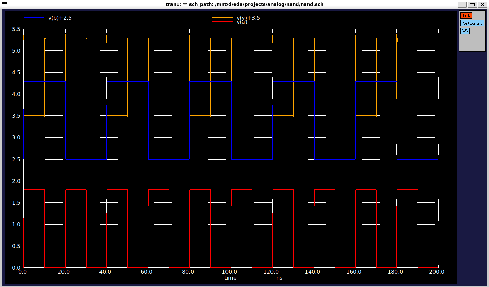
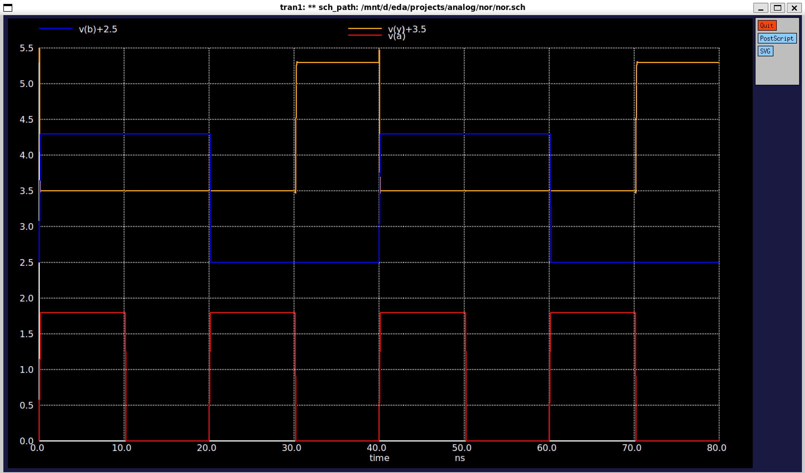

# CMOS Logic Gates using SKY130 PDK

Implementation and simulation of CMOS logic gates using the **SKY130 Open PDK**, **Xschem**, and **Ngspice**.

This repository demonstrates transistor-level design and verification of fundamental CMOS logic gates, forming the foundation for larger VLSI digital circuits.

---

## Tools Used

- Xschem
- Ngspice
- SKY130 Open PDK
- Magic VLSI (PDK setup)
- OSS CAD Suite

---

## Repository Structure

```
CMOS-Logic-Gates-SKY130/
│
├── NAND/
│   ├── nand.sch
│   ├── nand_schematic.png
│   ├── nand_waveform.png
│   └── README.md
│
├── NOR/
│   ├── nor.sch
│   ├── nor_schematic.png
│   ├── nor_waveform.png
│   └── README.md
│
└── README.md
```

---

## Implemented Gates

| Logic Gate | Status |
|------------|--------|
| CMOS NAND | ✅ Completed |
| CMOS NOR | ✅ Completed |

---

## Design Flow

1. Create transistor-level schematic in Xschem.
2. Connect SKY130 NMOS and PMOS devices.
3. Apply pulse input sources.
4. Include SKY130 transistor models.
5. Run transient simulation using Ngspice.
6. Verify output waveforms.

---

## SKY130 Model

Simulation uses the TT (Typical-Typical) process corner.

```spice
.lib sky130.lib.spice tt
```

---

## CMOS NAND

### Logic Function

```
Y = ~(A · B)
```

### Pull-Up Network

- Two PMOS connected in **parallel**

### Pull-Down Network

- Two NMOS connected in **series**

### Files

- nand.sch
- nand_schematic.png
- nand_waveform.png

---

## CMOS NOR

### Logic Function

```
Y = ~(A + B)
```

### Pull-Up Network

- Two PMOS connected in **series**

### Pull-Down Network

- Two NMOS connected in **parallel**

### Files

- nor.sch
- nor_schematic.png
- nor_waveform.png

---

## Input Stimulus

Transient simulations use pulse voltage sources:

```
VDD = 1.8V

A = PULSE(...)
B = PULSE(...)
```

The input timing is selected to verify every input combination.

---

## Simulation Results

Simulation confirms correct CMOS logic operation for:

- NAND Gate


- NOR Gate

Waveforms demonstrate expected output transitions for all input combinations.

---

## Skills Demonstrated

- CMOS transistor-level design
- Digital CMOS logic
- SKY130 Open PDK
- Xschem schematic capture
- Ngspice simulation
- Transient analysis
- VLSI design fundamentals

---

## Future Work

- NOT Gate
- AND Gate
- OR Gate
- XOR Gate
- XNOR Gate
- Transmission Gate
- Multiplexer
- D Flip-Flop
- SRAM Bitcell
- Standard Cell Library

---

## Author

**Aman Mishra**

B.Tech Electronics Engineering

Interested in:

- RTL Design
- ASIC Design
- Physical Design
- FPGA Design
- VLSI Research

GitHub:
https://github.com/amanmishra2003-EC

LinKdin:
https://www.linkedin.com/in/aman-mishra-ece/


---

## License

This project is intended for educational and research purposes.
