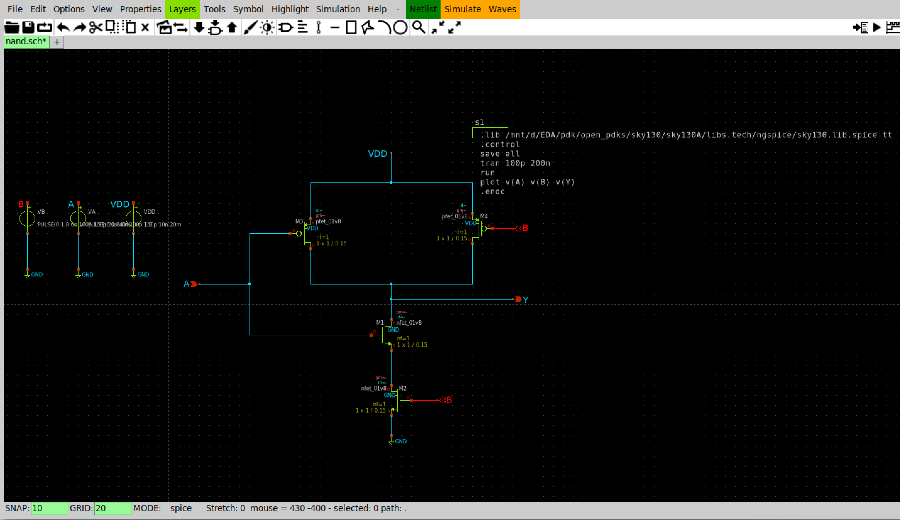
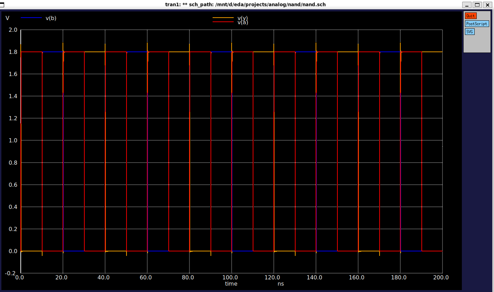

# CMOS NAND Gate using SKY130

## Logic

Y = ~(A · B)

## Pull-Up Network

Two PMOS in parallel.

## Pull-Down Network

Two NMOS in series.

## Files

- nand.sch
- nand_schematic.png
- nand_waveform.png

## Schematic

 

## Simulation

Transient simulation performed using Ngspice with SKY130 TT corner.

## Result

The output waveform matches the NAND truth table.