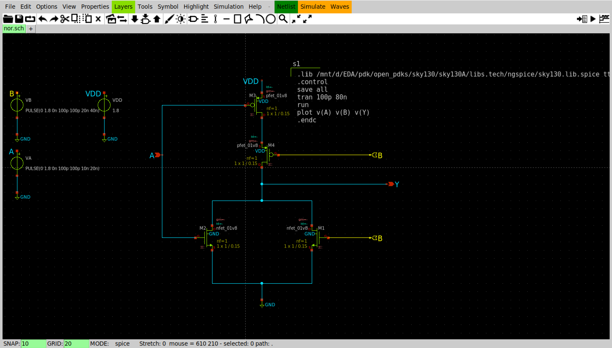
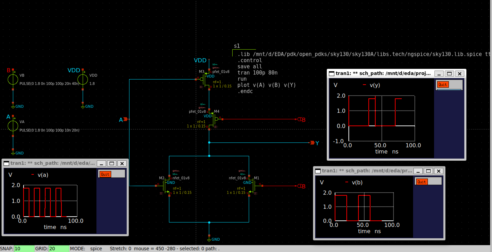
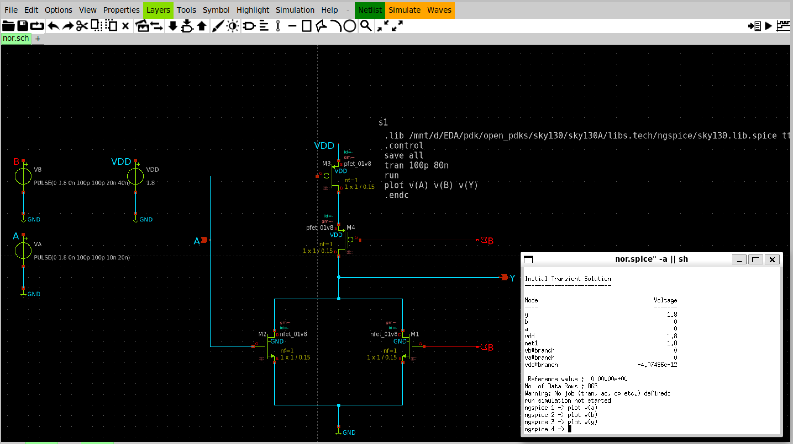

# CMOS NOR Gate using SKY130

## Logic

Y = ~(A + B)

## Pull-Up Network

Two PMOS in series.

## Pull-Down Network

Two NMOS in parallel.

## Files

- nor.sch
- nor_schematic.png
- nor_waveform.png

## Schematic

 

## Simulation

Transient simulation performed using Ngspice with SKY130 TT corner.

## Result

The output waveform matches the NOR truth table.